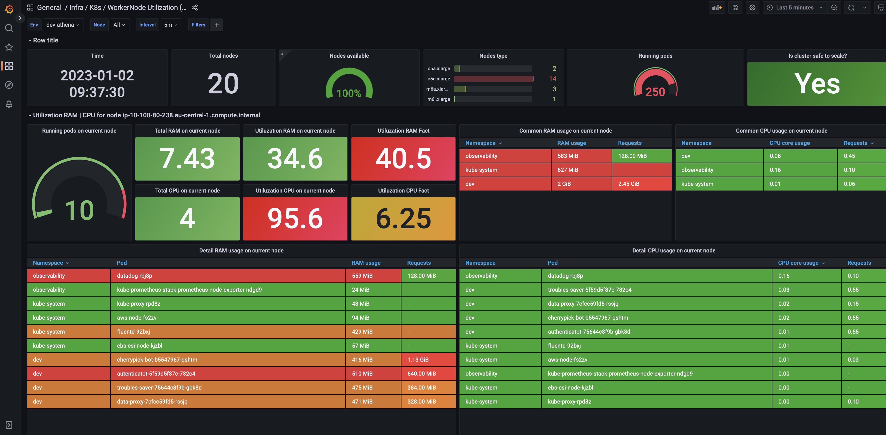

# k8s-nodes-utilization
A grafana dashboard that will help you understand the utilization on the nodes of the kubernetes cluster.

| Panel | Desctiption |
|-------|-------------|
| Time | current time |
| Total nodes | total amount of nodes in current k8s cluster |
| Nodes available | percentage aviability nodes |
| Nodes type | type of nodes | 
| Running pods | total amount of pods in all namespaces |
| Is cluster safe to scale? | health check in autoscaler |
| Running pods on current node | amount pods on current node |
| Total RAM on current node | |
| Total CPU on current node | |
| Utiluzation RAM on current node (plan) | calculated by request |
| Utiluzation CPU on current node (plan) | calculated by request |
| Utiluzation RAM Fact | calculated by phisical assumption |
| Utiluzation CPU Fact | calculated by phisical assumption |

